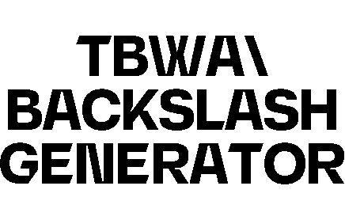

<!-- Improved compatibility of back to top link: See: https://github.com/floridomeacci/RoderickGPT -->

<!--
<!-- PROJECT LOGO -->
 

  

  

    For TBWA I utilised replicate.com API capabilities to create an AI backslash image generator.  The backslash being the TBWA companies logo, now embedded in all images.
     
     
    <a href="https://gen.tbwa.nl">View Demo</a>
  

<!-- ABOUT THE PROJECT -->
## About The Project

As a tribute to a colleague who departed from the company, I created RoderickGPT, a digital homage designed to embody his essence. RoderickGPT is a unique application that either communicates in Dunglish—a blend of broken English interlaced with Dutch words—or in Brabant's dialect, a regional variation of Dutch. Leveraging the OpenAI API, RoderickGPT is trained on datasets consisting of Roderick's anecdotes, meticulously translated and presented in both dialects to maintain purity in each dataset.

The website, accessible with the password **TBWA**, will be available until the end of 2024.

Key features include:
* The bobblehead talks and uses a typewriter effect.
* Images and/or videos pop-up after a while.
* Ask anything or use the suggested qeuries.

 

<!-- BUILT WITH -->
## Built With

* 
* 
* 
* 
* 

<!-- CONTACT -->
## Contact

Florido Meacci - meacciflorido@gmail.com

Project Link: [https://github.com/floridomeacci/RoderickGPT](https://github.com/floridomeacci/RoderickGPT)

(<a href="#readme-top">back to top</a>)

<!-- MARKDOWN LINKS & IMAGES -->
<!-- https://www.markdownguide.org/basic-syntax/#reference-style-links -->
